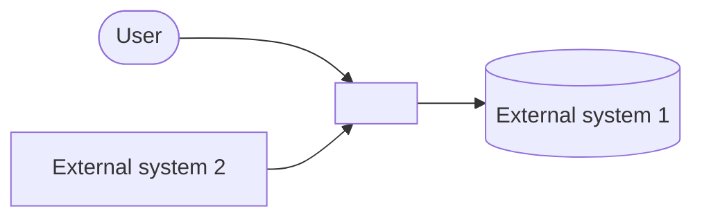
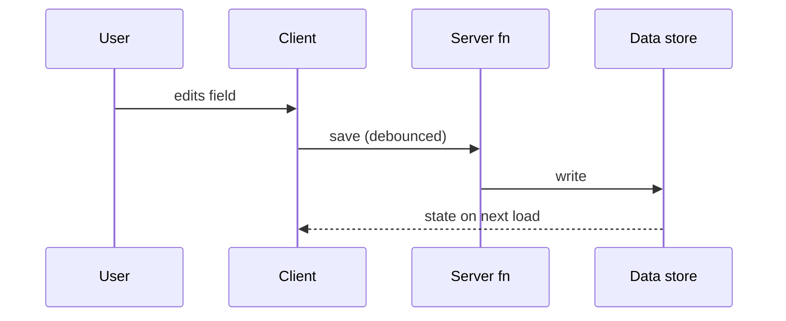

<!-- ARCHITECTURE OVERVIEW — a CURRENT-STATE doc (it can rot; append-only logs can't).
     Rot-guards, all three mandatory:
     1. "Last reconciled" date below — update it every time you sweep this file.
     2. This file is a row in the write-handoff pre-handoff sweep: reconcile the sections your
        session's work touched; at absolute minimum fix any claim the session INVERTED.
     3. Document only LOAD-BEARING and STABLE things — if it changes weekly, it doesn't belong
        here. Point at other sources of truth (guards registry, PLAN_LOG); never duplicate them.
     This markdown is the SOURCE OF TRUTH. Visual/HTML versions are RENDERS — generate them from
     this file on demand (an agent can build an HTML artifact from it anytime); never maintain a
     second copy by hand (two sources describing one architecture = drift).
     Structure follows the C4 model's top two levels only (context → containers/layers) — detail
     below that rots faster than it helps. -->

# Architecture Overview — <PROJECT NAME>

**Last reconciled:** <YYYY-MM-DD> · **By:** <session/agent>

## 1. Context — the system and its neighbors

<One paragraph: what the system is, who uses it, and every external system it talks to (and in
which direction).>

## 2. Layers / containers — the deployable and conceptual pieces

<The table IS the map — one row per layer, key files named so an agent can jump straight in.>

| # | Layer | What it does | Key files |
|---|---|---|---|
| 1 | <e.g. Persistence> | <one line> | <paths> |
| 2 | <e.g. Form state> | <one line> | <paths> |
| 3 | <e.g. Validation> | <one line> | <paths> |

## 3. Load-bearing patterns & invariants — pointers, not copies

<Name each pattern/invariant in one line and POINT to where it authoritatively lives. If you find
yourself re-explaining one here, stop — link it instead.>

- **<Pattern name>** — <one line> → see <file / guards registry row>
- **<Invariant>** — <one line, incl. what ENFORCES it (construction / test pin / convention)> → <pointer>

## 4. Core data flow — the tracer-bullet path, drawn

<ONE sequence diagram of the single most important path (e.g. user edit → save → persistence →
read-back → display). More flows only if they are genuinely load-bearing.>

## 5. Decisions

Architectural decisions live in `PLAN_LOG.md` entries and their decisions tables (ADRs by another
name) — this file does NOT restate them. List here only the 3–5 decisions a newcomer must know
before touching anything, each as one line + a pointer.

- <YYYY-MM-DD> — <decision in one line> → PLAN_LOG entry <ref>
